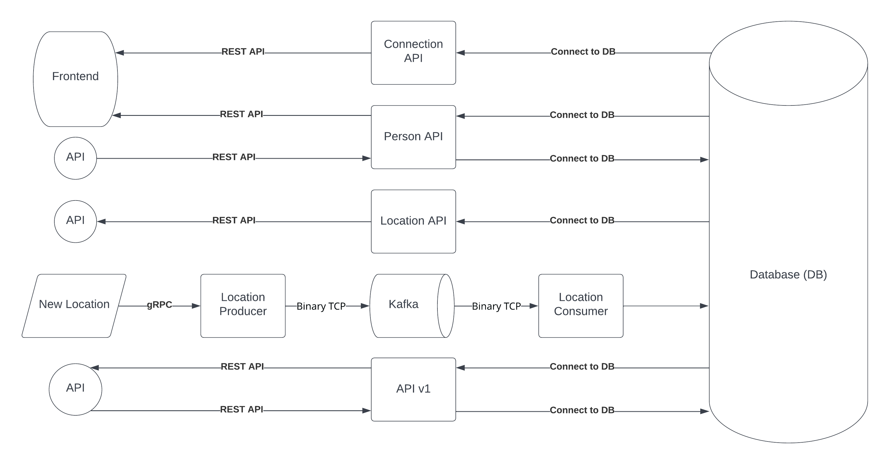

# UdaConnect
## Overview
### Background
Conferences and conventions are hotspots for making connections. Professionals in attendance often share the same interests and can make valuable business and personal connections with one another. At the same time, these events draw a large crowd and it's often hard to make these connections in the midst of all of these events' excitement and energy. To help attendees make connections, we are building the infrastructure for a service that can inform attendees if they have attended the same booths and presentations at an event.

### Description
UdaConnect uses location data from mobile devices. UdaConnect has been built a [POC](https://en.wikipedia.org/wiki/Proof_of_concept) application to ingest location data named UdaTracker. This POC was built with the core functionality of ingesting location and identifying individuals who have shared a close geographic proximity.


### Technologies
* [Flask](https://flask.palletsprojects.com/en/1.1.x/) - API webserver
* [SQLAlchemy](https://www.sqlalchemy.org/) - Database ORM
* [PostgreSQL](https://www.postgresql.org/) - Relational database
* [PostGIS](https://postgis.net/) - Spatial plug-in for PostgreSQL enabling geographic queries]
* [Vagrant](https://www.vagrantup.com/) - Tool for managing virtual deployed environments
* [VirtualBox](https://www.virtualbox.org/) - Hypervisor allowing you to run multiple operating systems
* [K3s](https://k3s.io/) - Lightweight distribution of K8s to easily develop against a local cluster
* [Helm](https://helm.sh/docs/intro/install/) - manager Kubernetes applications — Helm Charts helps define, install, and upgrade even the most complex Kubernetes application.

### Architecture



## Running the app
The project has been set up such that you should be able to have the project up and running with Kubernetes.

### Prerequisites
We will be installing the tools that we'll need to use for getting our environment set up properly.
1. [Install Docker](https://docs.docker.com/get-docker/)
2. [Set up a DockerHub account](https://hub.docker.com/)
3. [Set up `kubectl`](https://rancher.com/docs/rancher/v2.x/en/cluster-admin/cluster-access/kubectl/)
4. [Install VirtualBox](https://www.virtualbox.org/wiki/Downloads) with at least version 6.0
5. [Install Vagrant](https://www.vagrantup.com/docs/installation) with at least version 2.0

### Environment Setup
To run the application, you will need a K8s cluster running locally and to interface with it via `kubectl`. We will be using Vagrant with VirtualBox to run K3s.

#### Initialize K3s
In this project's root, run `vagrant up`.
```bash
$ vagrant up
```
The command will take a while and will leverage VirtualBox to load an [openSUSE](https://www.opensuse.org/) OS and automatically install [K3s](https://k3s.io/). When we are taking a break from development, we can run `vagrant suspend` to conserve some ouf our system's resources and `vagrant resume` when we want to bring our resources back up. Some useful vagrant commands can be found in [this cheatsheet](https://gist.github.com/wpscholar/a49594e2e2b918f4d0c4).

#### Set up `kubectl`
After `vagrant up` is done, you will SSH into the Vagrant environment and retrieve the Kubernetes config file used by `kubectl`. We want to copy the contents of this file into our local environment so that `kubectl` knows how to communicate with the K3s cluster.
```bash
$ vagrant ssh
```
You will now be connected inside of the virtual OS. Run `sudo cat /etc/rancher/k3s/k3s.yaml` to print out the contents of the file. You should see output similar to the one that I've shown below. Note that the output below is just for your reference: every configuration is unique and you should _NOT_ copy the output I have below.

Copy the contents from the output issued from your own command into your clipboard -- we will be pasting it somewhere soon!
```bash
$ sudo cat /etc/rancher/k3s/k3s.yaml

apiVersion: v1
clusters:
- cluster:
    certificate-authority-data: LS0tLS1CRUdJTiBDRVJUSUZJQ0FURS0tLS0tCk1JSUJWekNCL3FBREFnRUNBZ0VBTUFvR0NDcUdTTTQ5QkFNQ01DTXhJVEFmQmdOVkJBTU1HR3N6Y3kxelpYSjIKWlhJdFkyRkFNVFU1T1RrNE9EYzFNekFlRncweU1EQTVNVE13T1RFNU1UTmFGdzB6TURBNU1URXdPVEU1TVROYQpNQ014SVRBZkJnTlZCQU1NR0dzemN5MXpaWEoyWlhJdFkyRkFNVFU1T1RrNE9EYzFNekJaTUJNR0J5cUdTTTQ5CkFnRUdDQ3FHU000OUF3RUhBMElBQk9rc2IvV1FEVVVXczJacUlJWlF4alN2MHFseE9rZXdvRWdBMGtSN2gzZHEKUzFhRjN3L3pnZ0FNNEZNOU1jbFBSMW1sNXZINUVsZUFOV0VTQWRZUnhJeWpJekFoTUE0R0ExVWREd0VCL3dRRQpBd0lDcERBUEJnTlZIUk1CQWY4RUJUQURBUUgvTUFvR0NDcUdTTTQ5QkFNQ0EwZ0FNRVVDSVFERjczbWZ4YXBwCmZNS2RnMTF1dCswd3BXcWQvMk5pWE9HL0RvZUo0SnpOYlFJZ1JPcnlvRXMrMnFKUkZ5WC8xQmIydnoyZXpwOHkKZ1dKMkxNYUxrMGJzNXcwPQotLS0tLUVORCBDRVJUSUZJQ0FURS0tLS0tCg==
    server: https://127.0.0.1:6443
  name: default
contexts:
- context:
    cluster: default
    user: default
  name: default
current-context: default
kind: Config
preferences: {}
users:
- name: default
  user:
    password: 485084ed2cc05d84494d5893160836c9
    username: admin
```
Type `exit` to exit the virtual OS and you will find yourself back in your computer's session. Create the file (or replace if it already exists) `~/.kube/config` and paste the contents of the `k3s.yaml` output here.

Afterwards, you can test that `kubectl` works by running a command like `kubectl describe services`. It should not return any errors.

### Steps
1. `kubectl apply -f deployment/db-configmap.yaml` - Set up environment variables for the pods
2. `kubectl apply -f deployment/db-secret.yaml` - Set up secrets for the pods
3. `kubectl apply -f deployment/postgres.yaml` - Set up a Postgres database running PostGIS
4. `kubectl apply -f deployment/udaconnect-api.yaml` - Set up the service and deployment for the API v1
5. `kubectl apply -f deployment/udaconnect-location-api.yaml` - Set up the service and deployment for the Location API
6. `kubectl apply -f deployment/udaconnect-person-api.yaml` - Set up the service and deployment for the Person API
7. `kubectl apply -f deployment/udaconnect-connection-api.yaml` - Set up the service and deployment for the Connection API
8. `kubectl apply -f deployment/udaconnect-app.yaml` - Set up the service and deployment for the web app
9. `sh scripts/run_db_command.sh <POD_NAME>` - Seed your database against the `postgres` pod. (`kubectl get pods` will give you the `POD_NAME`)
  or run next command:
  `cat ./db/2020-08-15_init-db.sql | kubectl exec -it <POD_NAME> -- psql -h localhost -U ct_admin -d geoconnections`
  `cat ./db/udaconnect_public_person.sql | kubectl exec -it  <POD_NAME> -- psql -h localhost -U ct_admin -d geoconnections`
  `cat ./db/udaconnect_public_location.sql | kubectl exec -it  <POD_NAME> -- psql -h localhost -U ct_admin -d geoconnections`
10. Install and configure kafka in Kubernetes

  ##### 10.1 `vagrant ssh` SSH into the vagrant box
  
  ##### 10.2 Install helm on the guest VM
  ```
  curl -fsSL -o get_helm.sh https://raw.githubusercontent.com/helm/helm/main/scripts/get-helm-3

  chmod 700 get_helm.sh

  ./get_helm.sh
  ```
  
  ##### 10.3 `sudo su` Go to superuser
  
  ##### 10.4 Instal kafka
  ```
  helm repo add bitnami https://charts.bitnami.com/bitnami

  helm install udaconnect-kafka bitnami/kafka  --kubeconfig /etc/rancher/k3s/k3s.yaml 
  ```
  
  ##### 10.5 Save the contents from the output issued from your own command
  ```
  NAME: udaconnect-kafka
  LAST DEPLOYED: Wed Oct 19 06:59:08 2022
  NAMESPACE: default
  STATUS: deployed
  REVISION: 1
  TEST SUITE: None
  NOTES:
  CHART NAME: kafka
  CHART VERSION: 19.0.0
  APP VERSION: 3.3.1

  ** Please be patient while the chart is being deployed **

  Kafka can be accessed by consumers via port 9092 on the following DNS name from within your cluster:

      udaconnect-kafka.default.svc.cluster.local

  Each Kafka broker can be accessed by producers via port 9092 on the following DNS name(s) from within your cluster:

      udaconnect-kafka-0.udaconnect-kafka-headless.default.svc.cluster.local:9092

  To create a pod that you can use as a Kafka client run the following commands:

      kubectl run udaconnect-kafka-client --restart='Never' --image docker.io/bitnami/kafka:3.3.1-debian-11-r1 --namespace default --command -- sleep infinity
      kubectl exec --tty -i udaconnect-kafka-client --namespace default -- bash

      PRODUCER:
          kafka-console-producer.sh \

              --broker-list udaconnect-kafka-0.udaconnect-kafka-headless.default.svc.cluster.local:9092 \
              --topic test

      CONSUMER:
          kafka-console-consumer.sh \

              --bootstrap-server udaconnect-kafka.default.svc.cluster.local:9092 \
              --topic test \
              --from-beginning
  ```
  
  ##### 10.6 2 x `exit` Logout from vagrant box
  
  ##### 10.7 `kubectl get` pods verify the installation
  
  ##### 10.8 Wait until 'kafka-0' pod is in the running state
  
  ##### 10.9 Create topic 'location'
  ```
  kubectl exec -it udaconnect-kafka-0 -- kafka-topics.sh \
    --create --bootstrap-server udaconnect-kafka-headless:9092 \
    --replication-factor 1 --partitions 1 \
    --topic 'location'
  ```

11. `kubectl apply -f deployment/kafka-configmap.yaml` - Set up environment variables for the pods
12. `kubectl apply -f deployment/udaconnect-location-consumer.yaml`
13. `kubectl apply -f deployment/udaconnect-location-producer.yaml`
14. Test gRPC pipeline through kafka
  ##### 14.1 `kubectl exec -it <location-producer-pod-name> sh` Go in location-producer (`kubectl get pods` will give you the `location-producer-pod-name`)
  ##### 14.2 `python app/grpc_location_generator.py` Execute the grpc location generator with the command below 
  ##### 14.3 Check logs
  ```
  kubectl logs -f <location-producer-pod-name>

  kubectl logs -f <location-consumer-pod-name>
  ```


Manually applying each of the individual `yaml` files is cumbersome but going through each step provides some context on the content of the starter project. In practice, we would have reduced the number of steps by running the command against a directory to apply of the contents: `kubectl apply -f deployment/`.

Note: The first time you run this project, you will need to seed the database with dummy data. Use the command `sh scripts/run_db_command.sh <POD_NAME>` against the `postgres` pod. (`kubectl get pods` will give you the `POD_NAME`). Subsequent runs of `kubectl apply` for making changes to deployments or services shouldn't require you to seed the database again!

### Verifying it Works
Once the project is up and running, you should be able to see 10 deployments and 13 services (+ `kubernetes`, `udaconnect-kafka-zookeeper-headless` and `udaconnect-kafka-headless`) in Kubernetes:
`kubectl get pods` looks like:


`kubectl get services` looks like:


These pages should also load on your web browser:
* `http://localhost:30001/` - OpenAPI Documentation for API v1
* `http://localhost:30001/api/` - Base path for API v1
* `http://localhost:30011/` - OpenAPI Documentation for Location API
* `http://localhost:30011/api/` - Base path for Location API
* `http://localhost:30031/` - OpenAPI Documentation for Person API
* `http://localhost:30031/api/` - Base path for Person API
* `http://localhost:30041/` - OpenAPI Documentation for Connection API
* `http://localhost:30041/api/` - Base path for Connection API
* `http://localhost:30000/` - Frontend ReactJS Application

#### Deployment Note
You may notice the odd port numbers being served to `localhost`. [By default, Kubernetes services are only exposed to one another in an internal network](https://kubernetes.io/docs/concepts/services-networking/service/). This means that `udaconnect-app` and `udaconnect-api` can talk to one another. For us to connect to the cluster as an "outsider", we need to a way to expose these services to `localhost`.

Connections to the Kubernetes services have been set up through a [NodePort](https://kubernetes.io/docs/concepts/services-networking/service/#nodeport). (While we would use a technology like an [Ingress Controller](https://kubernetes.io/docs/concepts/services-networking/ingress-controllers/) to expose our Kubernetes services in deployment, a NodePort will suffice for development.)

## Configs and Secrets
In `deployment/db-secret.yaml`, the secret variable is `d293aW1zb3NlY3VyZQ==`. The value is simply encoded and not encrypted -- this is ***not*** secure! Anyone can decode it to see what it is.
```bash
# Decodes the value into plaintext
echo "d293aW1zb3NlY3VyZQ==" | base64 -d

# Encodes the value to base64 encoding. K8s expects your secrets passed in with base64
echo "hotdogsfordinner" | base64
```
This is okay for development against an exclusively local environment and we want to keep the setup simple so that you can focus on the project tasks. However, in practice we should not commit our code with secret values into our repository. A CI/CD pipeline can help prevent that.

## PostgreSQL Database
The database uses a plug-in named PostGIS that supports geographic queries. It introduces `GEOMETRY` types and functions that we leverage to calculate distance between `ST_POINT`'s which represent latitude and longitude.

_You may find it helpful to be able to connect to the database_. In general, most of the database complexity is abstracted from you. The Docker container in the starter should be configured with PostGIS. Seed scripts are provided to set up the database table and some rows.
### Database Connection
While the Kubernetes service for `postgres` is running (you can use `kubectl get services` to check), you can expose the service to connect locally:
```bash
kubectl port-forward svc/postgres 5432:5432
```
This will enable you to connect to the database at `localhost`. You should then be able to connect to `postgresql://localhost:5432/geoconnections`. This is assuming you use the built-in values in the deployment config map.
### Software
To manually connect to the database, you will need software compatible with PostgreSQL.
* CLI users will find [psql](http://postgresguide.com/utilities/psql.html) to be the industry standard.
* GUI users will find [pgAdmin](https://www.pgadmin.org/) to be a popular open-source solution.

## Tips
* We can access a running Docker container using `kubectl exec -it <pod_id> sh`. From there, we can `curl` an endpoint to debug network issues.
* The starter project uses Python Flask. Flask doesn't work well with `asyncio` out-of-the-box. Consider using `multiprocessing` to create threads for asynchronous behavior in a standard Flask application.
